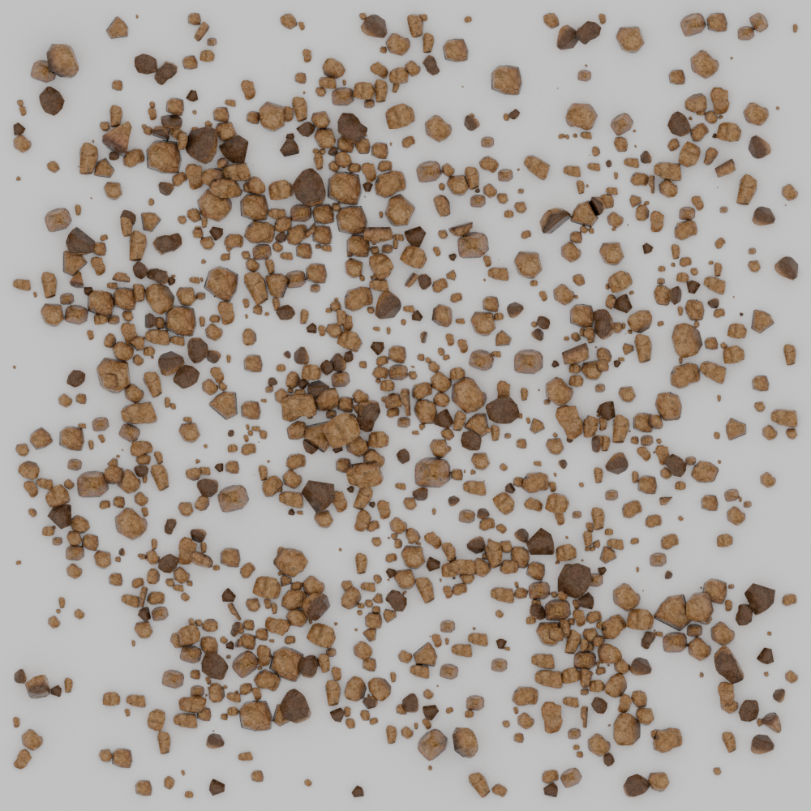
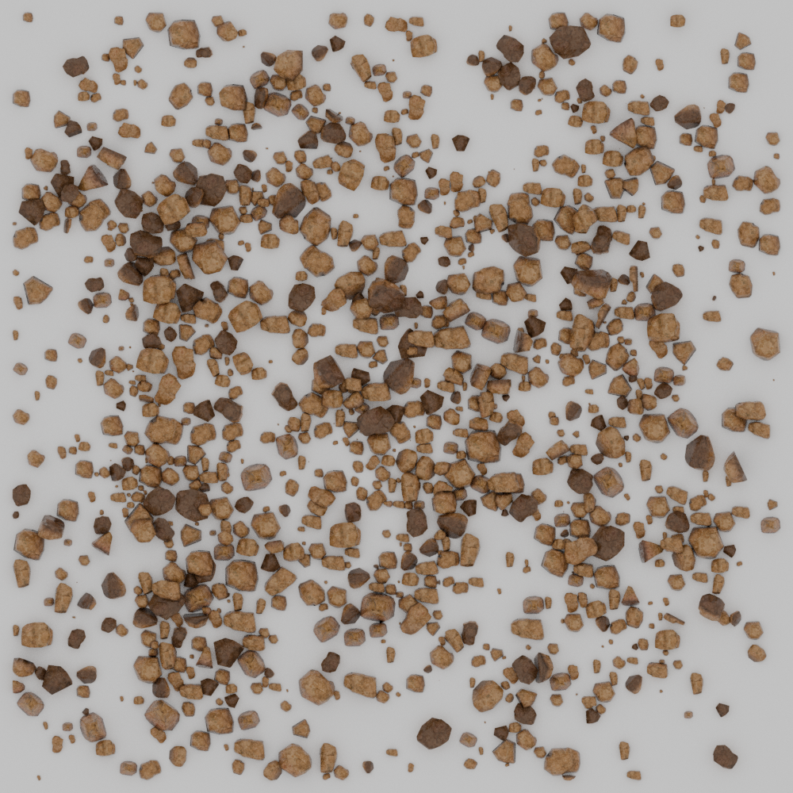
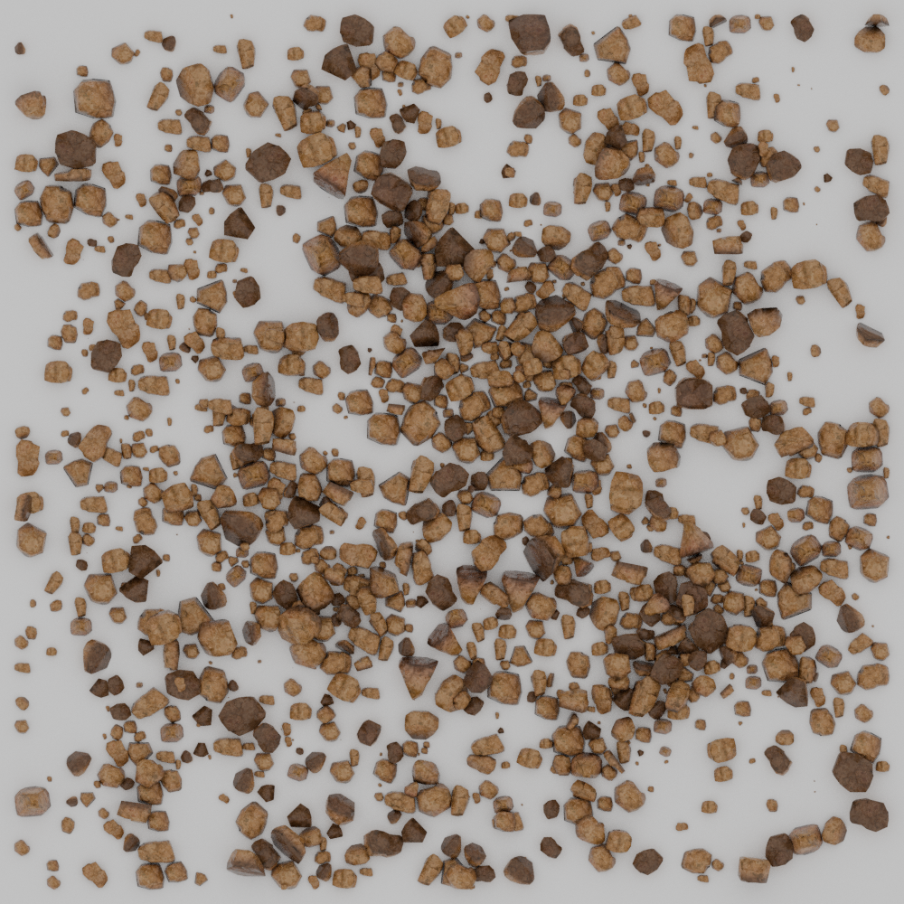
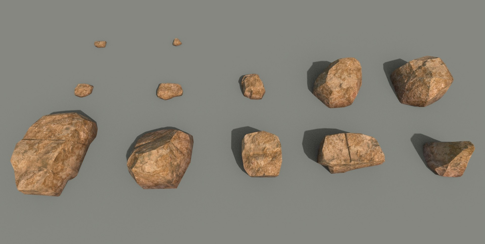
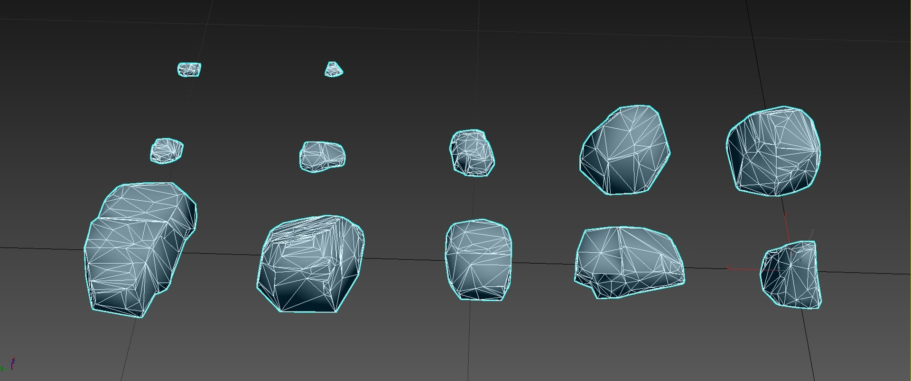
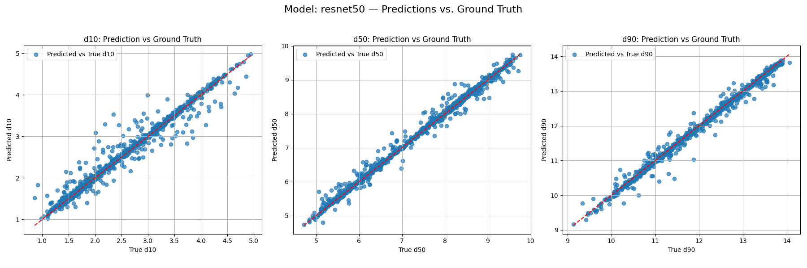
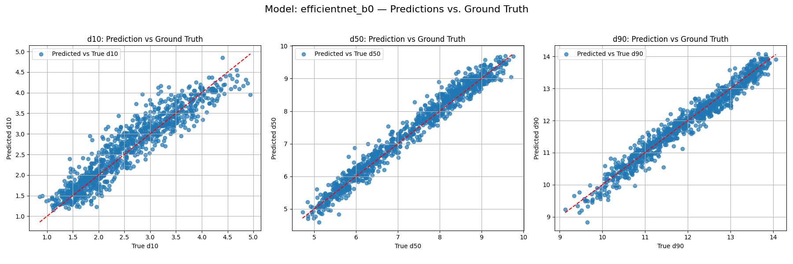
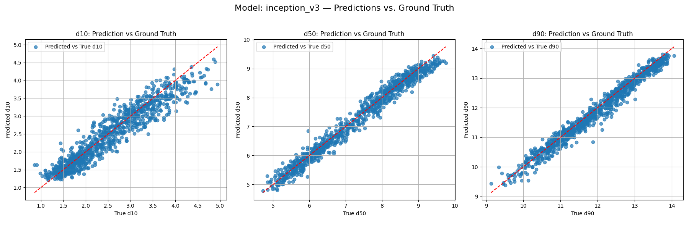

# Instant Particle Size Distribution Measurement Using CNNs Trained on Synthetic Data

[](https://openreview.net/forum?id=wPgGTUWmhl)
[](https://www.python.org/downloads/)
[](https://opensource.org/licenses/MIT)

This repository contains the official implementation of the paper "Instant Particle Size Distribution Measurement Using CNNs Trained on Synthetic Data". Our work demonstrates how synthetic data generation can be effectively used to train deep learning models for granular material analysis, specifically for particle size distribution measurement.

## Overview

### Synthetic Data Examples
<div align="center">
  
</div>

### Rock Models and Mesh Structure
<div align="center">
 
</div>

Our approach uses synthetic data generation to train CNNs for instant particle size distribution measurement. The method involves:
1. Generating synthetic granular material images using 3D models
2. Training various CNN architectures on this synthetic dataset
3. Evaluating the models' performance on real-world granular material images

## Installation

### Environment Setup

```bash
# Clone the repository
git clone https://github.com/YasserElj/Synthetic-Granular-Gen.git
cd Synthetic-Granular-Gen

# Create and activate conda environment
conda env create -f environment.yml
conda activate synthetic-granular-env
```

## Dataset Generation

### Rock Models
The synthetic dataset is generated using 3D rock models. We used free rock models from [TurboSquid](https://www.turbosquid.com/3d-models/yellow-stone-rock-set-pbr-1486885). You'll need to:
1. Download the rock models from the link above
2. Place them in the `rock_models/` directory

### Generating the Dataset

```python
python generate_data.py \
    --num_samples 1000 \
    --output_dir data/dataset \
    --rock_models_dir rock_models \
    --image_size 224 \
    --min_rocks 50 \
    --max_rocks 200
```

Key parameters:
- `--num_samples`: Number of synthetic images to generate
- `--output_dir`: Directory to save the generated dataset
- `--rock_models_dir`: Directory containing the 3D rock models
- `--image_size`: Output image size (default: 224x224)
- `--min_rocks`: Minimum number of rocks per image
- `--max_rocks`: Maximum number of rocks per image

## Training

To train a model on the synthetic dataset:

```python
python train_model.py \
    --model resnet50 \
    --data_dir data/dataset \
    --output_dir results/resnet50 \
    --batch_size 32 \
    --epochs 100 \
    --learning_rate 0.001 \
    --pretrained True
```

Key parameters:
- `--model`: Model architecture (options: resnet50, efficientnet_b0, inception_v3)
- `--data_dir`: Path to the dataset
- `--output_dir`: Directory to save model weights and results
- `--batch_size`: Training batch size
- `--epochs`: Number of training epochs
- `--learning_rate`: Initial learning rate
- `--pretrained`: Use pretrained weights (default: True)

## Inference

For inference on new images:

```python
python src/test_inference_with_metrics.py \
    --model_path results/resnet50/best_model.pth \
    --image_path path/to/image.jpg \
    --output_dir results/inference
```

## Results

### Model Performance Visualization

#### ResNet50 Predictions


#### EfficientNet-B0 Predictions


#### Inception-v3 Predictions

### Quantitative Results

#### Inference Speed and Performance Comparison

| Model | R² Score | GPU Speed (FPS) | CPU Speed (FPS) |
|-------|----------|-----------------|-----------------|
| ResNet50 | 0.9987 | 24.65 | 6.17 |
| EfficientNet-B0 | 0.9959 | 24.08 | 15.14 |
| Inception-v3 | 0.9966 | 23.73 | 4.13 |

Key observations:
- ResNet50 achieves the best accuracy (R² = 0.9987) and highest GPU throughput (24.65 FPS)
- EfficientNet-B0 shows best CPU performance at 15.14 FPS
- All models achieve real-time inference (>20 FPS) on GPU

## Citation

If you find this work useful, please cite our paper:

```bibtex
@inproceedings{
    title={Instant Particle Size Distribution Measurement Using CNNs Trained on Synthetic Data},
    author={},
    booktitle={},
    year={2023}
}
```

## License

This project is licensed under the MIT License - see the [LICENSE](LICENSE) file for details.

## Acknowledgments

- Rock models used for synthetic data generation were obtained from [TurboSquid](https://www.turbosquid.com/3d-models/yellow-stone-rock-set-pbr-1486885)
- Implementation built using PyTorch and related libraries 